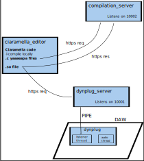

# Ciaramella to Dynplug

A set of tools to compile and run a Ciaramella program on the fly inside a never-stopping audio plugin 

## Sub-modules
- [Zampogna](https://github.com/paolomarrone/Zampogna). It is a compiler for the Ciaramella programming language. It can produce C code with a [yaaaeapa](https://github.com/paolomarrone/yaaaeapa) wrapper.
- [yaaaeapa_compilation_server](https://github.com/paolomarrone/yaaaeapa_compilation_server). A web server that accepts a set of .c and .h files following the yaaaeapa API, compiles them and returns the compiled shared object (.so). 
- [dynplug](https://github.com/paolomarrone/dynplug). A plugin (currently only in VST3 format) that can load at runtime and execute a yaaaeapa plugin without interrupting the its execution.
- [dynplug_server](https://github.com/paolomarrone/dynplug_server). A web server that continuosly waits for a yaaaeapa compiled plugin, and that sends it to a dynplug instance running on the same machine (or same filesystem).

## Behaviour

The standard behaviour is:
- Compile Ciaramella code and obtain A.c, A.h, and A_yaaaeapa_wrapper.c files
- Request yaaaeapa_compilation_server to compile them and obtain a built.so file
- Send built.so file to dynplug_server

## Execution

via
- node (see test.js)
- web browser (include crmToDynplug-web.js)

